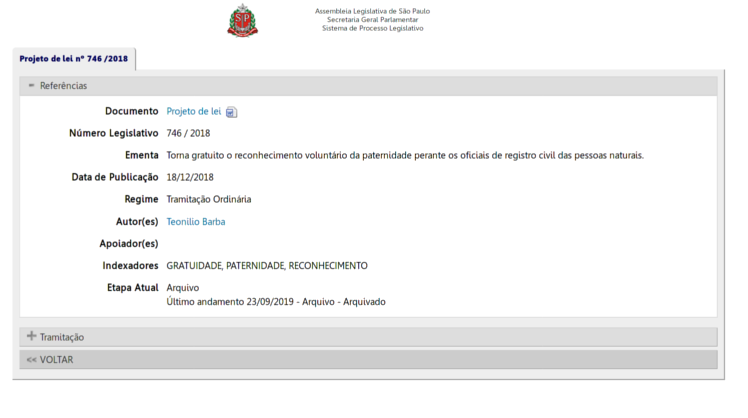

# Live Python Fundamentals 

Repositório do conteúdo ministrado na live de Python Fundamentals da 4Linux no dia 22/04/2020.


## Requisitos

Para este conteúdo, basta ter instalado o **python3** e o gerenciador de pacotes **pip**. Não é necessário uma IDE completa para este laboratório, um editor de texto puro simples já basta. Lembrando que o editor de código é sempre uma preferência do programador em questão.

Os pacotes instalados estão no arquivo _requirements.txt_. 

## WebScraping

A ideia da live é demonstrar como um ferramental básico de python nos ajuda a resolver tarefas interessantes como o **web scraping**.

O Web Scraping é uma técnica de coleta de dados não estruturados disponíveis na web. Basicamente, trata-se de um acesso automatizado para coletar informações presentes no html dos sites.

Existem inúmeras aplicações de web scraping, a saber algumas delas:

- Coletar informações sobre preços de produtos
- Monitorar ações
- Clipping de notícias
- Coleta de dados públicos 
- Pesquisa acadêmica 


## Desafio

O desafio proposto na live era estruturar os dados de projetos de lei disponíveis no website da [Assembléia Legislativa de São Paulo - ALESP](https://www.al.sp.gov.br/alesp/projetos/?tipo=1&ano=2018). 

<!-- Imagem de um projeto de lei  -->



### Parte 1 

O script contido na pasta 1 tem como objetivo explorar o webscraping - partiremos de uma descrição detalhada do que é preciso fazer para:

1. Conseguir fazer o python se comunicar com o site alvo

Para esta tarefa, será necessário utilizar o pacote **urllib** nativo do python para realizar uma requisição de uma página na web

2. Extrair as informações em formato html 

Utilizar de **contextos** para ter uma requisição e leitura dos dados bem sucedida.

3. Manipular as informações coletadas 

Utilizar a biblioteca **bs4** para realizar o _parsing_ da estrutura html do site de modo que seja possível navegar entre os objetos. Neste caso, o _BeautifulSoup_ cria uma estrutura de objetos semelhante a uma árvore - os objetos são as _tags_ html, as quais podem possuir outras tags, podem possuir texto e atributos. 

4. Filtrar os dados de interesse

Nesta etapa, será necessário verificar como acessar objetos e estruturas básicas como listas e dicionários no python para navegar até o conteúdo de interesse.

5. Armazenar em uma estrutura de dados típica do Python

Após o filtro bem sucedido das informações, armazenar os dados em um dicionário - uma estrutura bem próxima ao formato _JSON_ - Javascript Object Notation. 


### Parte 2

Com o êxito no na coleta de um projeto de lei (PL), a ideia é repetir o processo para coletar um volume maior de PLs. Para tal precisaremos:

1. Mapear os endereços das PLs alvo para coleta

Neste caso, será necessário identificar no html em que parte do site contém os links para os PLs de um determinado ano

2. Escalar os procedimentos realizados na primeira parte para todos os endereços  

A partir da lista de links, criar um laço para extrair as informações de interesse. Por questões de tempo, resolvi pegar apenas os 100 primeiros PLs. 

## Divertimentos

### Modularização 

Você deve ter percebido que o código está em um único arquivo base. Por mais que seja uma quantidade pequena de código, as **responsabilidades** são diferentes - o primeiro tem como objetivo extrair dados da PL em si, e o outro tem como objetivo mapear os links disponíveis. 

Nesse sentido, por que não modularizar o código em scripts diferentes, e utilizar um terceito script que conduza o fluxo da atividade? 

Para resolver esse problema, será necessário conhecer sobre **modulos e pacotes** em python. 

### Destino dos dados

Ao final da parte 2, teríamos uma lista com 100 projetos de lei no formato desejado. Há diversas formas de persistir essa informação para uso posterior:

1. Salvar em um arquivo no formato JSON
2. Salvar em um arquivo no forma CSV
3. Aproveitar o formato de dicionário e utilizar um banco de dados não relacional (como o **MongoDB**) para armazenar as informações.

Para resolver essa etapa, recomendo a utilização de pacotes como:

- Pandas (para lidar com formatos csv, xls, etc)
- JSON (para realizar dumps no formato json)
- PyMongo (driver de conexão para o sistema gerenciador de banco de dados MongoDB)

### Coletando mais informações

Se você estiver bem atento, perceberá que as urls possuem proposições da câmara, e normativas diretas do executivo, na figura do governador. Caso as estruturas de html forem diferentes, como compatibilizar os scripts para lidar com ambos os casos? 

Além das informações básicas dos projetos de lei, temos um segundo bloco na página que indica a **tramitação** do projeto na camara. Poder-se-ia adicionar tais informações no dicionário que criamos, na forma de um sub-documento:

``` python
pl = {
	"num_legistativo" : "",
	"ementa" : "",
	"data_publicacao" : "",
	"regime" : "",
	"autores" : "",
	"apoiadores" : "",
	"indexadores" : "",
	"etapa_atual" : "",
	"tramitacao" : {
		"datas" : [],
		"descricao": []
	}
}
```

Pede-se para verificar os casos inconsistentes, e adicionar a estrutura de tramitação no dicionário conforme o exemplo acima. 

## Python Fundamentals

Se você se interessou em saber mais sobre python, a 4Linux oferece cursos de python em diversas áreas - sysadmin, desenvolvimento e big data. Para maiores informações acesse: 

- https://www.4linux.com.br/cursos/python
- https://www.4linux.com.br/cursos/bigdata
